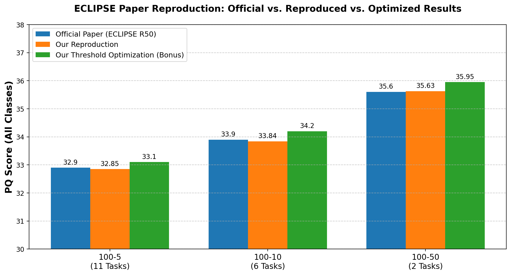

# Reproducing ECLIPSE: Continual Panoptic Segmentation on ADE20K

> Python course project — reproduction and analysis of the CVPR 2024 paper
> **ECLIPSE: Efficient Continual Learning in Panoptic Segmentation with Visual Prompt Tuning**.

**Author:** Daniel Chicherin, Or Blazer  ·  **Course:** Python  ·  **Instructor:** Andrey Dolgin  ·  **Date:** May 2026

**Project website:** [`https://PsYDaniel.github.io/ECLIPSE-reproduction/`](https://PsYDaniel.github.io/ECLIPSE-reproduction/)
**Project video (≤ 3 min):** [▶️ Watch on YouTube](VIDEO_LINK_HERE)

---

## 1. What this project does

Continual learning asks a model to keep learning *new* categories over time without forgetting the
ones it already knows. This is hard for **panoptic segmentation** (labelling every pixel and
separating every object instance), because naively fine-tuning on new classes causes
*catastrophic forgetting* of the old ones.

**ECLIPSE** tackles this by *freezing* the entire base segmentation model (a Mask2Former with a
ResNet-50 backbone) and learning only a tiny set of **visual prompts** for each new batch of
classes — roughly **1.3% of the parameters** are trainable. It adds *logit manipulation* to reduce
semantic drift between old and new classes.

This repository **reproduces the paper's reported results** on the ADE20K continual panoptic
benchmark across three difficulty settings, and adds a small **bonus experiment** that lowers the
object-mask confidence threshold to recover low-confidence masks.

The entire pipeline runs in a single Google Colab notebook:
[`notebook/PythonEclipseImprovement.ipynb`](notebook/PythonEclipseImprovement.ipynb).

## 2. Results

PQ = **Panoptic Quality** (higher is better), measured over *all* classes after the final task.

| Scenario | Tasks | Official paper (ECLIPSE R50) | Our reproduction | Our bonus (threshold 0.5 → 0.35) |
|:--------:|:-----:|:----------------------------:|:----------------:|:--------------------------------:|
| 100-50   | 2     | 35.6 | 35.63 | 35.95 |
| 100-10   | 6     | 33.9 | 33.84 | 34.20 |
| 100-5    | 11    | 32.9 | 32.85 | 33.10 |

Our reproduction lands within ±0.1 PQ of the published numbers in every setting, confirming the
paper is reproducible. Lowering the mask threshold gives a small but consistent gain.



*The "100-50" notation means 100 base classes learned first, then 50 new classes added in
increments. 100-50 adds all 50 at once (2 tasks); 100-10 adds them 10 at a time (6 tasks); 100-5
adds them 5 at a time (11 tasks). More tasks = more chances to forget = harder.*

## 3. Repository structure

```
ECLIPSE-reproduction/
├── index.html                 # Project website (GitHub Pages landing page)
├── README.md                  # You are here — project overview
├── docs/
│   ├── documentation.md       # Full technical documentation
│   ├── algorithmic-thinking.md# Project stages + how each stage is tested
│   └── ai-collaboration.md    # How AI was used + how to reproduce per stage
├── plan/
│   └── ai-plan.md             # The AI-generated project plan (human-edited)
├── notebook/
│   └── PythonEclipseImprovement.ipynb   # The actual project code
├── results/
│   └── reproduction_graph.png # Official vs. reproduced vs. optimized chart
├── takeaways.pdf              # Reflective writeup (Hebrew, 1–2 pages)
├── requirements.txt           # Environment notes
├── GITHUB_SETUP.md            # How to publish this repo + what to fill in
└── LICENSE
```

## 4. Submission checklist (per course spec)

Every item the course requires, and where to find it:

| # | Required item | Location |
|:-:|---------------|----------|
| 1 | Project documentation (Markdown) | [`README.md`](README.md) + [`docs/documentation.md`](docs/documentation.md) |
| 2 | Algorithmic thinking — project stages | [`docs/algorithmic-thinking.md`](docs/algorithmic-thinking.md) §2 |
| 3 | Algorithmic thinking — how each stage is tested | [`docs/algorithmic-thinking.md`](docs/algorithmic-thinking.md) §3 |
| 4 | AI plan file (parallel) | [`plan/ai-plan.md`](plan/ai-plan.md) |
| 5 | AI collaboration — reproducing results per stage | [`docs/ai-collaboration.md`](docs/ai-collaboration.md) |
| 6 | Reflective takeaways (1–2 pages) | [`takeaways.pdf`](takeaways.pdf) |
| 7 | Project video (2–5 min) | [Linked above](VIDEO_LINK_HERE) and on the website |
| 8 | GitHub project website | [`index.html`](index.html) → published via GitHub Pages |

## 5. How to reproduce (quick version)

The full, annotated pipeline is in the notebook; the short version is:

1. **Open the notebook in Google Colab** with a GPU runtime
   (`Runtime → Change runtime type → GPU`).
2. **Clone ECLIPSE** and install dependencies — Detectron2, panopticapi,
   cityscapesScripts, and the repo's `requirements.txt`.
3. **Compile the custom CUDA op** (MultiScaleDeformableAttention). The notebook patches a
   `.scalar_type().is_cuda()` call to `.is_cuda()` so it compiles on current PyTorch.
4. **Prepare ADE20K** — download the images and run the three `prepare_ade20k_*` scripts to build
   the semantic / panoptic / instance annotations Detectron2 expects.
5. **Download the released checkpoints** (`ade_ps_100_50_final.pth`, `…100_10…`, `…100_5…`) and run
   each scenario script in **`--eval-only`** mode (training is commented out — we evaluate the
   released weights).
6. **(Bonus)** Lower `OBJECT_MASK_THRESHOLD` from `0.5` to `0.35` and re-evaluate.

See [`docs/documentation.md`](docs/documentation.md) for the detailed, step-by-step version and
[`docs/algorithmic-thinking.md`](docs/algorithmic-thinking.md) for the reasoning behind each step.

## 6. Acknowledgements & references

- **ECLIPSE** — Kim, Yu, Hwang. *ECLIPSE: Efficient Continual Learning in Panoptic Segmentation with
  Visual Prompt Tuning.* CVPR 2024.
  [Paper (arXiv:2403.20126)](https://arxiv.org/abs/2403.20126) ·
  [Official code](https://github.com/clovaai/ECLIPSE)
- **Mask2Former** — Cheng et al. *Masked-attention Mask Transformer for Universal Image
  Segmentation.* CVPR 2022.
- **ADE20K** — Zhou et al. *Scene Parsing through ADE20K Dataset.* CVPR 2017.
- **Detectron2** — Wu et al., Facebook AI Research.

This is an educational reproduction. All credit for the ECLIPSE method belongs to the original
authors; see [`LICENSE`](LICENSE) for details.
